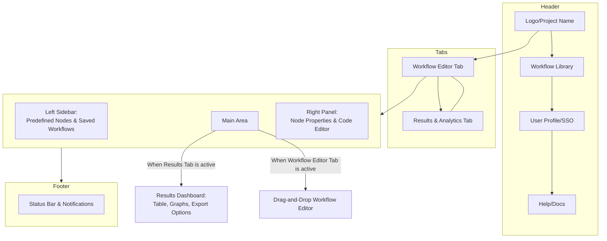

```mermaid
flowchart TD
  %% Header Section
  subgraph Header
    A[Logo/Project Name] --> B[Workflow Library]
    B --> C[User Profile/SSO]
    C --> D[Help/Docs]
  end

  %% Tabs for navigation
  subgraph Tabs [Tabs]
    E[Workflow Editor Tab] --- F[Results & Analytics Tab]
  end

  %% Main UI Section: Sidebar, Main Area, and Properties Panel
  subgraph MainUI [ ]
    direction LR
    G[Left Sidebar:<br/>Predefined Nodes & Saved Workflows]
    H[Main Area]
    I[Right Panel:<br/>Node Properties & Code Editor]
  end

  %% Footer Section
  subgraph Footer
    J[Status Bar & Notifications]
  end

  %% Connections between sections
  A --> E
  E --> F
  E --> MainUI
  MainUI --> Footer

  %% Main Area Options
  H -- "When Workflow Editor Tab is active" --> K[Drag-and-Drop Workflow Editor]
  H -- "When Results Tab is active" --> L[Results Dashboard:<br/>Table, Graphs, Export Options]
```