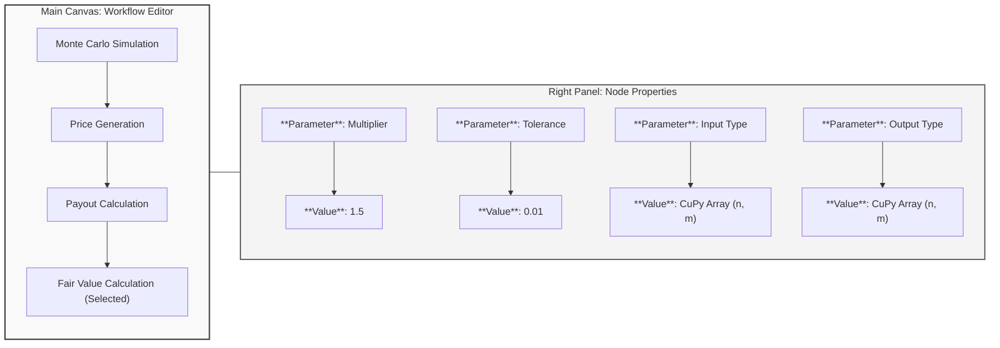

```mermaid
flowchart LR
  %% Main Canvas: Workflow Editor with connected nodes
  subgraph Canvas[Main Canvas: Workflow Editor]
    Node1["Monte Carlo Simulation"]
    Node2["Price Generation"]
    Node3["Payout Calculation"]
    Node4["Fair Value Calculation (Selected)"]
    Node1 --> Node2
    Node2 --> Node3
    Node3 --> Node4
  end

  %% Right Panel: Tabular list of parameters and values
  subgraph Properties[Right Panel: Node Properties]
    Param1["**Parameter**: Multiplier"]
    Value1["**Value**: 1.5"]
    Param2["**Parameter**: Tolerance"]
    Value2["**Value**: 0.01"]
    Param3["**Parameter**: Input Type"]
    Value3["**Value**: CuPy Array (n, m)"]
    Param4["**Parameter**: Output Type"]
    Value4["**Value**: CuPy Array (n, m)"]
    Param1 --> Value1
    Param2 --> Value2
    Param3 --> Value3
    Param4 --> Value4
  end

  %% Layout connections
  Canvas --- Properties

  %% Styling
  classDef canvasStyle fill:#f9f9f9,stroke:#333,stroke-width:2px;
  classDef propertiesStyle fill:#f4f4f4,stroke:#666,stroke-width:2px;
  class Canvas canvasStyle;
  class Properties propertiesStyle;
```